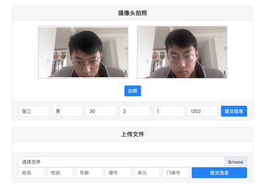
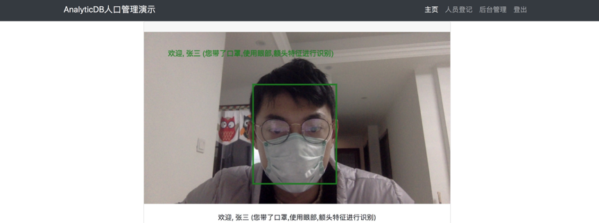

## 简介
本方案通过AnalyticDB和人脸识别, 眼部特征识别, 口罩识别算法搭建了一套针对新冠肺炎疫情的小区出入管理系统. 可以支持戴口罩情景下的人脸识别.
1. 自动登记入册小区人口基本信息和人脸特征，界面如下:

<div align=center>

</div>
 
2. 通过摄像头自动做人脸识别，返回来访者家庭的所有出入记录. 方便社区管理者进行高效的出入管理,在当前疫情环境下, 人们普遍佩戴口罩, 去掉口罩会增加肺炎感染的风险, 所以本方案提供一套支持戴口罩情况下人脸识别的算法. 演示效果如下：

<div align=center>

</div>

3. 可以通过人脸照片和结构化信息的任意组合来检索住户的来访记录，并提供统计分析能力，为小区管理者提供全局度量数据.

<div align=center>

</div>

## 使用方法:
### 安装[docker](https://www.docker.com/)

### 生成docker镜像或下载docker镜像
#### 直接下载docker镜像(推荐):
[地址](https://adbvdb.oss-cn-hangzhou.aliyuncs.com/adb_face/adb_face.tar.gz
)

下载后解压tar xzvf 解压缩tar xzvf adb_face.docker.tar.gz 

进入解压后的目录: cd adb_face 

加载docker镜像: docker load -i adb_face.docker.tar
#### 生成docker镜像

从[这里](https://adbvdb.oss-cn-hangzhou.aliyuncs.com/adb_face/adb_models.tar.gz
)下载AnalyticDB模型然后解压至app/tf_serving/

从[这里](https://github.com/seetafaceengine/SeetaFace2#4-%E6%A8%A1%E5%9E%8B%E4%B8%8B%E8%BD%BD)下载Seetaface模型fd_2_00.dat, pd_2_00_pts5.dat 摆放至 SeetaFace2/python/resource/

```commandline
cd docker
sh build.sh <image-name>
```

### 启动docker镜像:
获得AnalyticDB连接串. 可以加入下方钉钉群免费试用. 
```commandline
cd start
cp config_template config.yml
# 将链接信息填入config.yml
sh start.sh <image-name>
```
打开chrome访问localhost:8000

有问题可以加入AnalyticDB的向量团队钉钉沟通群。


## License
Apache 2.0

## 依赖
本项目依赖Seetaface2引擎:https://github.com/seetafaceengine/SeetaFace2
